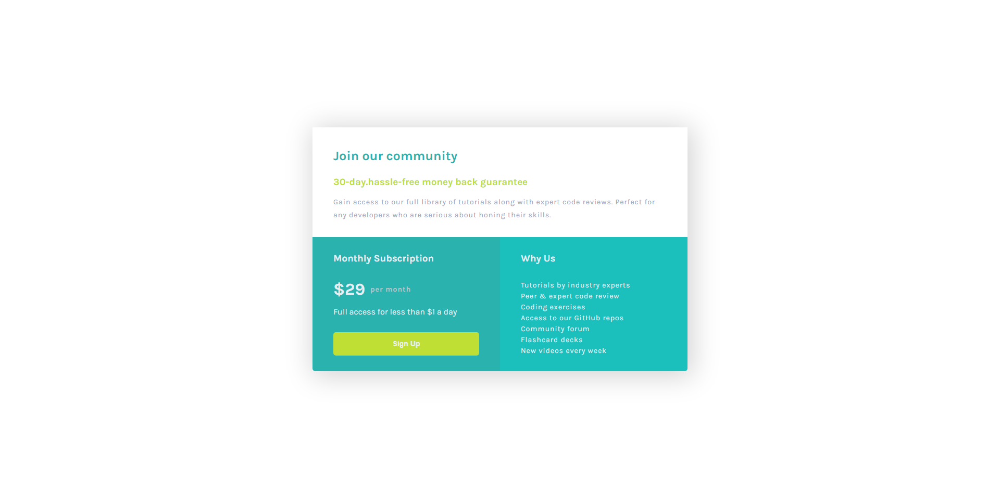

# Frontend Mentor - Single price grid component solution

This is a solution to the [Single price grid component challenge on Frontend Mentor](https://www.frontendmentor.io/challenges/single-price-grid-component-5ce41129d0ff452fec5abbbc). Frontend Mentor challenges help you improve your coding skills by building realistic projects.

## Table of contents

- [Overview](#overview)
  - [The challenge](#the-challenge)
  - [Screenshot](#screenshot)
  - [Links](#links)
- [My process](#my-process)
  - [Built with](#built-with)
  - [What I learned](#what-i-learned)
  - [Useful resources](#useful-resources)
- [Author](#author)

## Overview

### The challenge

Users should be able to:

- View the optimal layout for the component depending on their device's screen size
- See a hover state on desktop for the Sign Up call-to-action

### Screenshot

### Links

- Solution URL: [Add solution URL here](https://your-solution-url.com)
- Live Site URL: [Add live site URL here](https://your-live-site-url.com)

## My process

### Built with

- Semantic HTML5 markup
- CSS custom properties
- Flexbox
- Responsive Design

### What I learned

- I learned how to make a responsive component using Media Query.

### Useful resources

- [HTML](https://www.w3schools.com/html/default.asp) - This helped me for HTML tags
- [CSS](https://www.w3schools.com/css/default.asp) - This helped me it CSS

## Author

- Github - [AbdulrhmanMousa](https://github.com/AbdulrhmanMousa)
- Frontend Mentor - [@Abdulrhman-Moses](https://www.frontendmentor.io/profile/Abdulrhman-Moses)
